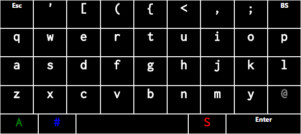
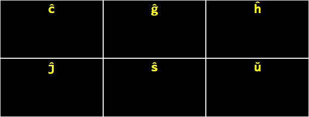

# MobileWebPcControl

Simulate a keyboard on the PC using a mobile web browser.

## Installation

1. Install [Node](https://nodejs.org/).
2. Clone this repository and then run:

```
npm install
```

## Usage

Run `node server/web.js` or `npm start`.
Then, in the web browser, visit the site on port 3001.

To type an accented letter, touch its base character for 200 milliseconds.

## Configuration

All screens and keyboards are in files named following the pattern **configuration/screen.*.html**.
Missing accented letters may be added by editing the file **configuration/screen.diacritics.html**.

Sounds and vibrations can be disabled by editing the file **configuration/configuration.js**.

Screen and touch animations can be customized, or entirely disabled, by editing the file **browser/index.css**.

When to enter full screen mode can be defined in **browser/index.js**.

## Screenshots





## TypeScript

To transpile the TypeScript files to JavaScript, use Gulp.

```
gulp typings
gulp ts
```
